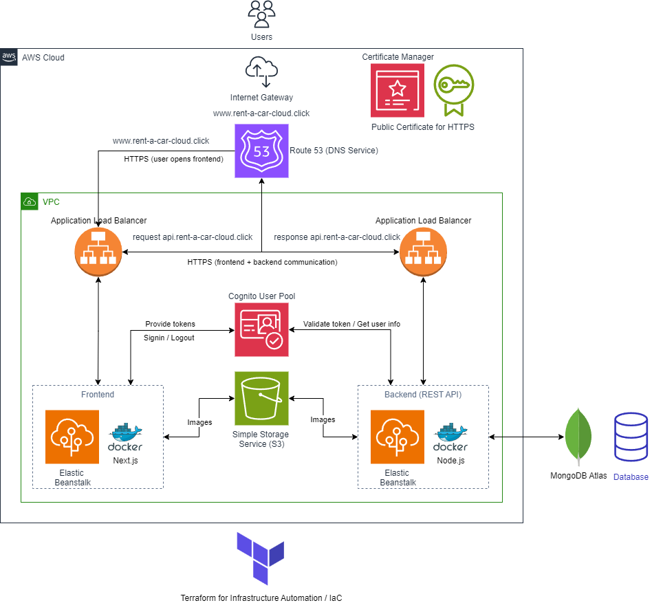

# Deployment

Infrastructure deployment:



## AWS Services Overview
The infrastructure utilizes multiple AWS services, each fulfilling a specific role in the system architecture:

- **Route 53:** Provides reliable and scalable DNS management for the domain `rent-a-car-cloud.click`. It ensures that user requests are correctly routed to the frontend application through DNS resolution.

- **Certificate Manager:** Manages and provisions SSL/TLS certificates to secure all traffic between the client and server, ensuring end-to-end encrypted communication via HTTPS.

- **Application Load Balancers:** Distribute traffic efficiently between the frontend and backend, enhancing availability and reliability. The frontend load balancer provides an endpoint for frontend requests, while the backend load balancer provides an endpoint for requests to the backend, which the frontend can utilize.

- **Elastic Beanstalk:** Provides a Platform-as-a-Service (PaaS) environment for deploying and managing our containerized applications. Both the frontend (Next.js) and backend (Node.js) are deployed on separate Elastic Beanstalk environments for clear separation of concerns and improved maintainability.

- **Cognito User Pool:** Handles user authentication and authorization. AWS Cognito provides managed user pools, issuing JWT tokens for securely verifying user identity and authorizing access to protected resources within the backend.

- **Simple Storage Service (S3):** Serves as a scalable cloud storage solution for user-uploaded images. AWS S3 ensures high availability, durability, and cost-efficiency, making it an ideal choice for managing media assets.

---

### Other Integrated Services
In addition to AWS services, we utilize external tools to enhance our infrastructure's efficiency and robustness:

- **MongoDB Atlas:** A fully-managed NoSQL cloud database used for storing application data such as car information, user reservations, and other relevant entities. Its high availability and flexible schema design make it well-suited for our application’s needs.

- **Terraform:** We use Terraform for Infrastructure as Code (IaC), allowing us to automate the provisioning and management of all AWS resources. The infrastructure is structured using Terraform modules divided for each AWS service, such as AWS Cognito, Elastic Beanstalk, and S3. This modular approach ensures consistency, scalability, and ease of management. The infrastructure can be fully deployed or modified using a single command (see Terraform.md):

```bash
terraform apply -auto-approve
```

## System Operation Workflow
The following steps describe how the system operates and how the different services interact during runtime:

1. The user accesses the frontend application via a browser at `www.rent-a-car-cloud.click`. The request is routed through the Internet Gateway and directed to Route 53 for DNS resolution.
   
2. Route 53 forwards the request to the Application Load Balancer, which securely directs the user to the frontend application running on Elastic Beanstalk. The connection is protected by SSL/TLS certificates managed by AWS Certificate Manager.
   
3. When requests are made to the backend, such as fetching car information or making a reservation, the frontend communicates with the backend's Application Load Balancer via HTTPS at `api.rent-a-car-cloud.click`. The backend service is deployed on Elastic Beanstalk, running a Node.js REST API.
   
4. For user authentication, the frontend redirects users to a managed login page provided by the AWS Cognito User Pool. Upon successful login, AWS Cognito issues JWT tokens, which the frontend uses to authenticate subsequent requests to the backend. The full authentication flow is explained in one of the subsequent sections.
   
5. Images uploaded by users are sent from the frontend to the backend, which stores them in AWS S3. Furthermore, the backend stores application data, such as car inventory and user reservations, in MongoDB Atlas.


## Cost Comparison: Single vs. Separate Elastic Beanstalk Services for Frontend and Backend
You can use Docker Compose to run both services in a single AWS EB service, or you can use two separate AWS EB services. Both have their advantages and disadvantages:

| Factor | **Single EB Service (Multi-Container in One EB Env)** | **Two Separate EB Services (Frontend & Backend in Different Envs)** |
|--------|--------------------------------------------------|------------------------------------------------------|
| **EC2 Instances** | ✅ **Shares the same EC2 instance** → Uses fewer resources. | ❌ **Each service gets its own EC2 instance** → More expensive. |
| **Load Balancer** | ✅ **One ELB (Elastic Load Balancer) for both** → Lower cost. | ❌ **Each service may require a separate ELB** → Doubles the cost. |
| **Scaling** | ❌ Both frontend and backend scale **together**, which may not be efficient. | ✅ Each service scales independently, optimizing costs for traffic patterns. |
| **Data Transfer** | ✅ Inter-service communication **is internal** (free inside AWS VPC). | ❌ Services communicate over the internet (potentially extra cost). |
| **Elastic IPs & DNS** | ✅ Only one Elastic Beanstalk domain. | ❌ Two separate Elastic Beanstalk domains. |
| **Operational Costs** | ✅ Easier to manage and deploy → Less maintenance overhead. | ❌ More complex → More DevOps work, possible higher labor costs. |

In summary:
| Deployment Method | Pros | Cons |
|------------------|------|------|
| **Single EB Service (Docker Compose via docker-compose.yml)** | ✅ Easier deployment, both services scale together, simple setup. | ❌ Less flexibility, both services share resources. |
| **Separate EB Services (One for Frontend, One for Backend)** | ✅ Can scale frontend & backend independently, better fault isolation. | ❌ More complex, needs manual service linking. |

Therefore: 

✅ **Using a single Elastic Beanstalk service with Docker Compose is more cost-effective**, especially for small applications.

❌ **Using two separate services is better for scaling independently but increases costs significantly** due to additional EC2 instances, load balancers, and potential inter-service data transfer costs.

It is a best practice to separate them, however, depending on the specific application it can also be possible to combine them into one service to optimize costs and simplicity for example.

Initially, given our tightly coupled architecture, we opted to deploy both the frontend and backend within a single Elastic Beanstalk environment using Docker Compose. While deploying them separately allows for independent scaling, we thought our application does not require such flexibility. Consolidating both services reduces infrastructure costs and simplified management. This decision aligns with one of our key requirements: optimizing cloud expenses. However, later we encountered many problems with this setup, such as a lack of modularization and decomposition in elements such as logs and error handling. Particularly during development we found it hard to identify the root service (frontend or backend) that caused problems. Therefore, we opted to switch to a setup with two load balanced Elastic Beanstalk environments, ensuring modularization and clear separation of concerns, increasing the maintainability of our system and solving the above encountered problems during development.


## GitHub Secrets and Variables
In GitHub, you can create secrets and variables for GitHub Actions in Settings > Security > Secrets and variables > Actions for example:
- https://docs.github.com/en/actions/security-for-github-actions/security-guides/using-secrets-in-github-actions
- https://docs.github.com/en/actions/writing-workflows/choosing-what-your-workflow-does/store-information-in-variables 

For the secrets and variables:
- Do not add quotes around values (only for strings with spaces for example, but not with URLs). This can cause problems in GitHub Actions, such as:
```
getaddrinfo ENOTFOUND 'http
```
This happened because the BACKEND_URL was inside '' in the GitHub environment variables. However, when removing the '' around it, it worked without problems.


### Required variables and secrets for GitHub Actions
The following repository secrets need to be created:
- DOCKER_USERNAME: Docker Hub username
- DOCKER_ACCESS_TOKEN: Docker personal access token (with read, write and delete permission): https://docs.docker.com/security/for-developers/access-tokens/

For the environment secrets, create an environment called main and add the following secrets (see backend/dummy.env):
- MONGO_URI: MongoDB connection string
- AWS_ACCESS_KEY_ID: AWS access key id
- AWS_SECRET_ACCESS_KEY: AWS access key secret
And add the following environment variables:
- API_NAME: Name of the API
- API_PORT: Port of the API
- FRONTEND_PORT: Port of the frontend
- API_VERSION: Version of the API (should be numerical only, since the deployed environment already uses api. in the domain, such as /v1)
- FRONTEND_URL: Frontend URL
- BACKEND_URL: Backend URL
- VEHICLE_URL: URL of the vehicle API
- AWS_REGION: AWS region used
- S3_BUCKET_NAME: AWS S3 bucket name (created with Terraform)
- EB_APP_NAME: AWS Elastic Beanstalk application name (created with Terraform)
- EB_ENV_NAME_PREFIX: AWS Elastic Beanstalk environment name prefix, can be extended with frontend or backend (created with Terraform)
- COGNITO_APP_CLIENT_ID: client id of the application created with the AWS Cognito user pool
- COGNITO_USER_POOL_ID: AWS Cognito user pool id
- COGNITO_DOMAIN: AWS Cognito user pool domain
- NEXT_PUBLIC_FRONTEND_URL: Frontend base URL including version
- NEXT_PUBLIC_BACKEND_FULL_URL: Backend URL including version
- NEXT_PUBLIC_COGNITO_AUTHORITY: AWS Cognito user pool authority, used for the frontend
- NEXT_PUBLIC_COGNITO_REDIRECT_SIGN_IN: AWS Cognito user pool sign in redirect URL
- NEXT_PUBLIC_COGNITO_REDIRECT_SIGN_OUT: AWS Cognito user pool sign out redirect URL
- DEPLOYED_FE_APP_DOMAIN_URL: domain of Route 53 and URL of the deployed frontend, such as https://www.rent-a-car-cloud.click 
- DEPLOYED_BE_APP_DOMAIN_URL: domain  of Route 53 and URL of the deployed backend, such as https://api.rent-a-car-cloud.click

Not all environment variables in the dummy.env are present here (such as for the frontend), since some variables are reused. For example, the COGNITO_APP_CLIENT_ID is used in the backend and frontend, but can be only one variable in the GitHub environment, and there the NEXT_PUBLIC_ prefix is specific to the Next.js frontend, since this is required to access the environment variable.

This needs to be in one environment, as GitHub Actions does not support multiple environments being loaded at this time.

In real world scenarios, you can create environments per stage, such as dev, test and prod, etc. Then in the GitHub Actions you can reference the corresponding environment for each workflow to use the correct environment, such as deploying to dev or prod, etc.