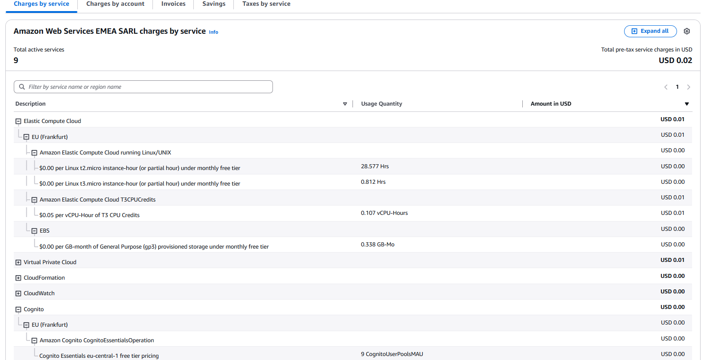
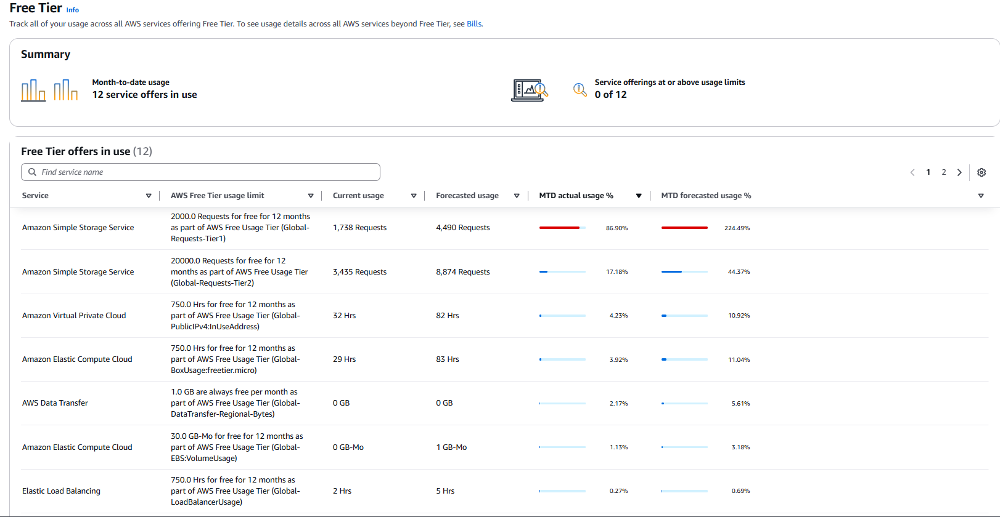

# Budgest & Pricing
This project is maintained by students and executed for the DevOps course project. Therefore, all costs are payed by the students, which is why the aim is to avoid all costs, i.e. have zero costs.

After creating an AWS account, the free tier can be used: https://aws.amazon.com/free/free-tier-faqs/. This free tier allows you to use a service for free up to a specific limit for the free tier (different for each service). If you extend this limit, you will get charged the normal rate, so it is very important to be careful when using these services to avoid (unexpected) costs! 

To avoid costs, these are some helpful tips:
1. Only use AWS resources that are covered by the free tier (see the documentation from the specific AWS resource to see if it is free tier eligible). If they are not eligible for the free tier usage, it means you will get charged for them.

2. Monitor costs in the "Billing and Cost Management" in the AWS Management Console.

3. Add Budgets to get notified when costs reach above a set budge (e.g. set it to $0.1 for a zero spend buget, and another to get notified when it exceeds $0.50, and a two final ones (or more budgets) to get notified when you spend more than that, such as $10 and $20 budgets for example): https://docs.aws.amazon.com/cost-management/latest/userguide/budgets-managing-costs.html. Specifically: https://docs.aws.amazon.com/cost-management/latest/userguide/budgets-create.html

4. Manage your infrastructure with a tool such as Terraform to automatically create and manage your infrastructure. This allows you to automatically remove all resources created, which can be helpful for the following step.
When configuring them and deploying the applications and services, you need to be very careful! For example, when using Ansible (and/or Terraform) for this, make sure you select/configure the free tier options (see the documentation of each specific service for which tiers/configurations are free), etc. See Terraform.md for more explanation on this.

5. Try to always destroy the infrastructure after you are done, such as at the end of each day (or more often after testing an application deployment for example, as these also use resources in the background, or you can stop the instance running in the Management Console, etc.), to avoid unexpected and unnecessary costs! The only exceptions is if you are sure that resources are free and you need them multiple days after each other, such as for a presentation, etc., then you can remove them afterwards. If you are using Terraform for example, you can also comment out resources in the main.tf file to exclude some resources, e.g., when you only want to test one or a selection of resources.
Also, keep in mind that for some resources you will be charged for the number of resources you currently have open/running. For example, for the AWS S3 general purpose buckets it stated this on the pricing page:
```
First 2,000 general purpose buckets per account / Month	-> Free
Over 2,000 general purpose buckets per account / Month	-> $0.02 per additional general purpose bucket
```
So, if you have more than 2000 general purpose buckets open at an account, you will not get charged. However, if you have 2001 or more buckets open at one point in time on your account, you will be charged $0.02 per month per bucket you have open over 2000. This does not mean the total number of buckets created, this is about the total number of buckets currently open for an account, so not the total number of buckets created (verified by chatbot from AWS). For example, if you have created 5000 buckets in your account and also deleted 3000 of them (so you do not have more than 2000 general purpose buckets currently open in your account), you will not be charged. Note: this is just an example, the exact pricing for each resource varies over time and per resource!

## Monitoring Usage and Costs in AWS
You should actively monitor your costs of your cloud resources, like explained in the above section. Below are steps to view overall costs and costs of the free tier.

Keep in mind: when you first create your AWS account it takes some time before the dashboards are shown, since AWS needs to make some forecasts, so be patient before it shows, can even take some days. And make sure to select the Global region for these dashboard, since otherwise not all costs could be shown. Additionally, it takes some time before the costs are shown here, so make sure to keep doing the above steps, such as shutting down unnecessary resources that are billed by running hours for example (e.g. the EB environment/EC2 instances) so that you do not get unexpected costs.

You can view your total costs in the AWS Management Console by following these steps
1. Go to Billing and Cost Management

2. Billing and Payments > Bills (example URL: https://us-east-1.console.aws.amazon.com/billing/home#/bills)

3. Then you can view your costs. The "Charges by service" is a useful section, where you can see all your charges per service and expand a couple (or use the "Expand all" tab for example), such as:


You can view the free tier usage in the AWS Management Console by following these steps:
1. Go to Billing and Cost Management

2. Cost and Usage Analysis > Free Tier (example URL: https://us-east-1.console.aws.amazon.com/billing/home#/freetier)

3. View your usage for the free tier, such as:
