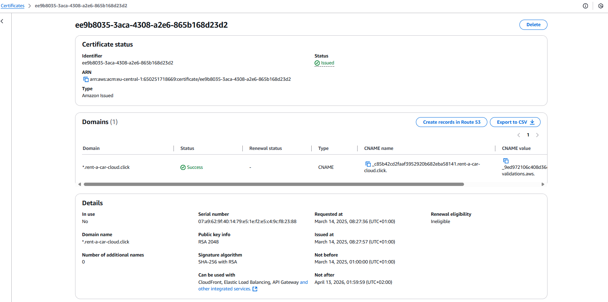
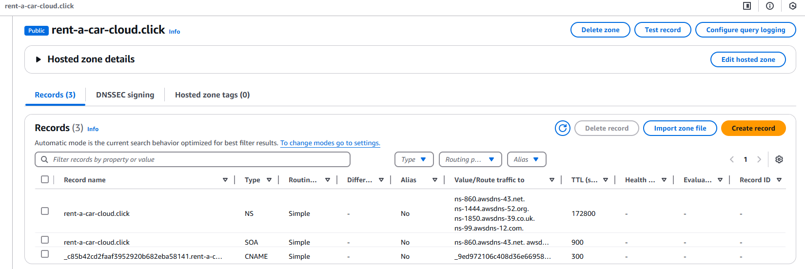
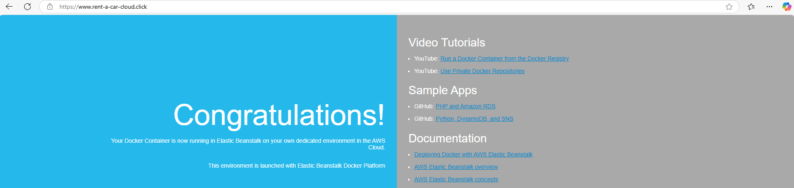

# Domains & Certification
This document explains how to create a domain with AWS Route 53 and get a certificate for this domain with AWS Certificate Manager (ACM). This document explains how you can manually set everything up. This is now changed to mostly Terraform (see Terraform.md), with the only manually required step being setting up the domain name with AWS Route 53. However, this document gives an explanation of the required steps to gain a better understanding how everything works in the background.

## Creating a domain with AWS Route 53 (DNS service)
Full documentation: https://docs.aws.amazon.com/route53/

Steps for creating a domain name: https://docs.aws.amazon.com/Route53/latest/DeveloperGuide/Welcome.html

The first step is to create a domain name for the application, see the above link to create the domain name. For example, you can create the following domain name: rent-a-car-cloud.click

The next step is to create a record in the domain, which can be used to route internet traffic to your domain. See the above link again. In short, you can create a record in AWS Route 53 to the deployed AWS Elastic Beanstalk Load balancer, such as:

In this example the following record is used: www.rent-a-car-cloud.click

## Getting a certificate with AWS Certificate Manager (ACM)
Full documentation: https://docs.aws.amazon.com/acm/

After following the previous steps, you can get a certificate for the domain, see: https://docs.aws.amazon.com/acm/latest/userguide/acm-public-certificates.html

You will request a public certificate, for example for the above domain record, use DNS validation. After requesting the certificate, click on "Create record in Route 53" and select the above created domain. Then after a few minutes, you should see a success and issued status:

The created record should be visible as CNAME in the records for the AWS Route 53 domain:

## Manually adding listener to Elastic Load Balancer to allow HTTPS
After the previous steps, you can add a listener to the load balancer in the AWS Management Console with the following information:L
- Listener protocol: HTTPS, port: 443 (typically the port of the incoming traffic)
- Instance protocol: HTTP, port: 80 (the port of the EC2 instance)
- Security policy can stay the default selected
- Default SSL/TLS certificate: select the certificate created in the previous step
- Cookie stickiness: Disabled

This can look like this for example:

Then you can go to the following URL on the web for example: https://www.rent-a-car-cloud.click/. This can look like this for example (you should see https in the URL and nothign saying not secure, meaning HTTPS is setup for this site):
